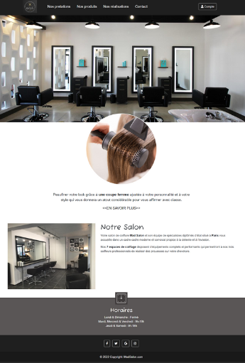

# Salon de Coiffure Website

Bienvenue dans le projet du site web du salon de coiffure ! Cette application web permet aux utilisateurs de se connecter et de prendre rendez-vous pour des services de coiffure.

## Fonctionnalités

- **Acceuil :**

- **Authentification :** Les utilisateurs peuvent créer un compte et se connecter pour accéder à des fonctionnalités personnalisées.

- **Réservation de rendez-vous :** Planifiez vos rendez-vous en sélectionnant le service souhaité, la date et l'heure.

## Outils Utilisés

- **HTML:** Structure de base de la page web.
  
- **CSS:** Style et mise en forme de l'interface utilisateur.

- **Bootstrap:** Framework CSS pour un design réactif.

- **JavaScript:** Interactivité et manipulation dynamique du contenu.

- **PHP:** Langage côté serveur pour la gestion des utilisateurs et des rendez-vous.

- **MySQL:** Base de données pour stocker les informations des utilisateurs et des rendez-vous.

## Captures d'écran

